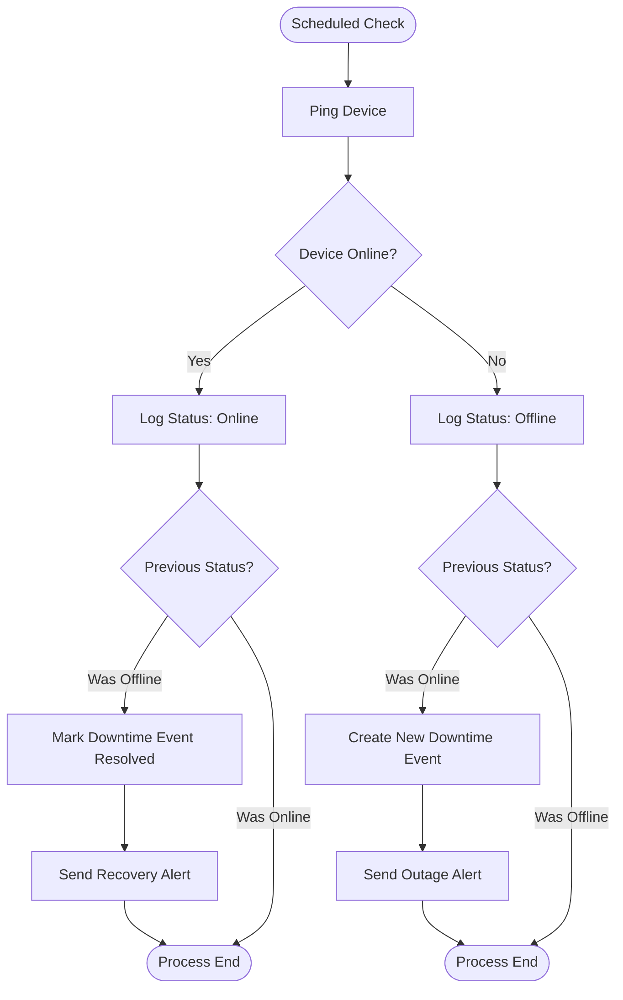

# Crestron Monitoring System - Process Flow

**Role:** Co-architect & Developer | **Tools:** Python, Flask, SQLite

**Problem:** IT support was reactive, discovering device failures only when users reported them.

**Solution:** I co-designed and developed a full-stack system to automate monitoring.

### Process Analysis & Design
Below is the business process flow I designed and implemented for the proactive monitoring solution.

